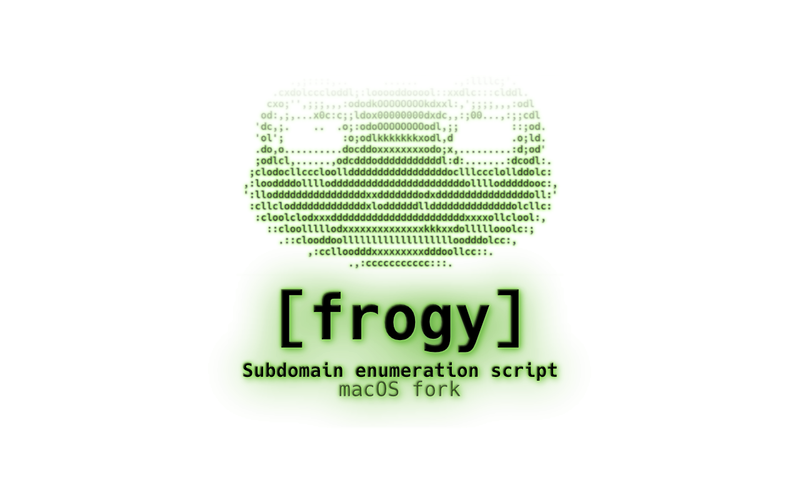

<h1 align="center">
  <a href="https://github.com/nekkitl/frogy"></a>
</h1>
<h4 align="center"> Made from 🇮🇳, forked by 🇷🇺 with ❤️</h4>

**Frogy** - Open-source Attack Surface Management solution for discovering all IPs, domains, subdomains, live websites, and login portals for a company. Fully rewritten in Python for macOS with improved reliability and user experience.

---

## 🆕 Version 0.0.3 - Major Update

### What's New in v0.0.3

**Complete Python Rewrite:**

- ✨ **Full Python implementation** - Complete rewrite from bash to Python for better reliability
- 🎨 **Colorful terminal interface** - Beautiful green frog banner and color-coded output
- ⏱️ **Timeout handling** - All operations have timeouts to prevent hangs
- 🔄 **Visual progress indicators** - Animated spinners show that the process is running
- 📊 **Detailed progress messages** - Gray info messages explain what each tool is doing
- 🧹 **--clean flag** - Easy cleanup of temporary files
- 🐛 **Better error handling** - Graceful degradation when tools are missing
- 📦 **Simplified codebase** - Integrated rootdomain.py, removed dnscan dependency

### Differences from v0.0.2

| Feature                 | v0.0.2 (Bash)                 | v0.0.3 (Python)                            |
| ----------------------- | ----------------------------- | ------------------------------------------ |
| **Language**            | Bash script                   | Python 3.11+                               |
| **Reliability**         | Could hang on long operations | Timeouts prevent hangs                     |
| **User Interface**      | Plain text output             | Colorful, animated progress                |
| **Error Handling**      | Basic                         | Comprehensive with graceful degradation    |
| **Dependencies**        | Required dnscan folder        | Self-contained, no external Python scripts |
| **Progress Visibility** | None                          | Real-time spinners and status messages     |
| **Cleanup**             | Manual                        | Automated with --clean flag                |

**Breaking Changes:**

- ⚠️ Bash script (`frogy.sh`) removed - use `python3 frogy.py` instead
- ⚠️ `dnscan` enumeration removed - replaced with more reliable methods
- ⚠️ Installation process simplified - no need for separate dependency scripts

---

### Why was the project forked?

Yo, I'm Nick, and I was disappointed by the lack of support for macOS.
We all know that many programs, for various reasons, can be built and run fine on the Mac. Basically, this project was released for Deb-based OS, but one night I rewrote and reworked the project for full Mac compatibility.

And I think that we need faster method to provide information to frogy. See usage for details.

_glhf, bruh_ 👽

---

### How it can help a large company (Some usecases):

- **Vulnerability management team:** Can use the result to feed into their known and unknown assets database to increase their vulnerability scanning coverage.
- **Threat intel team:** Can use the result to feed into their intel DB to prioritize proactive monitoring for critical assets.
- **Asset inventory team:** Can use the result to keep their asset inventory database up-to-date by adding new unknown assets facing Internet and finding contact information for the assets inside your organization.
- **SOC team:** Can use the result to identify what all assets they are monitoring vs. not monitoring and then increase their coverage slowly.
- **Patch management team:** Many large organizations are unaware of their legacy, abandoned assets facing the Internet; they can utilize this result to identify what assets need to be taken offline if they are not being used.

It has multiple use cases depending your organization's processes and technology landscape.

---

### Logic:


---

### Features:

- 🐸 **Horizontal subdomain enumeration** - Multiple enumeration sources
- 🐸 **Vertical subdomain enumeration** - Deep recursive discovery
- 🐸 **DNS resolution** - Resolving subdomains to IP addresses
- 🐸 **Live web application detection** - Identifying active web services
- 🐸 **Web intelligence** - Extracting contextual properties (title, content-length, server, IP, CNAME, etc.) via httpx
- 🎨 **Colorful interface** - Visual progress indicators and status messages
- ⚡ **Fast and reliable** - Timeout handling prevents hangs
- 🧹 **Easy cleanup** - Built-in temporary file management

---

### Installation:

```sh
git clone https://github.com/nekkitl/frogy.git && cd frogy && chmod +x install.sh && bash install.sh
```

The installer will automatically:

- Install Homebrew (if not present)
- Install all required tools (httpx, subfinder, dnsx, findomain, waybackurls, unfurl, anew, etc.)
- Install Python dependencies
- Copy binary tools to `/usr/local/bin/`

**Requirements:**

- macOS (tested on macOS 10.15+ till Tahoe 26.0.1)
- Python 3.11 or higher
- Internet connection for tool downloads

---

### Usage:

```sh
python3 frogy.py [root-domain] [organisation name] [--chaos] [--clean]
```

**Arguments:**

- `root-domain` - Root domain name (e.g., "example.com") - **required** unless using `--clean`
- `organisation name` - Organization name (optional) - used for output directory naming
- `--chaos` - Use CHAOS dataset for enumeration (optional)
- `--clean` - Clean all temporary files and exit

**Examples:**

```sh
# Basic usage
python3 frogy.py example.com

# With organization name
python3 frogy.py example.com "Internet Assigned Numbers Authority"

# With CHAOS dataset
python3 frogy.py example.com "Org Name" --chaos

# Clean temporary files
python3 frogy.py --clean
```

**What happens during execution:**

1. **Subdomain Enumeration** - Multiple sources:

   - CHAOS dataset (if enabled)
   - Amass passive enumeration
   - Wayback Machine historical data
   - Certificate Transparency logs
   - Findomain API
   - Subfinder recursive discovery

2. **DNS Resolution** - Using dnsx to resolve domains:

   - A, AAAA, CNAME records
   - NS, TXT, MX, SOA records
   - Zone transfer testing
   - Reverse DNS lookups

3. **Web Discovery** - Using httpx to find live web applications:
   - Scanning 100+ common ports
   - HTTP/HTTPS response analysis
   - Technology fingerprinting
   - Status code detection

---

## Demo:

<br/>

---

## Output:

Output files are saved in `output/<company_name>/` directory:

- `web_intelligence.csv` - Complete web application intelligence data
- `<company_name>.master` - Master list of all discovered subdomains
- `resolved.json` - DNS resolution results in JSON format
- `site_list.txtls` - List of live web applications
- `rootdomain.txtls` - Extracted root domains
- `raw_output/` - Raw enumeration results from each tool

Where `company_name` is derived from the organization name you provide (or domain name if not specified).

---

## Troubleshooting

**Script appears to hang:**

- Check the spinner animation - if it's spinning, the process is running
- Look for gray detail messages below the spinner explaining what's happening
- DNS resolution and web discovery can take several minutes for large domains

**Tools not found:**

- Run `bash install.sh` again to ensure all tools are installed
- Check that `/usr/local/bin/` is in your PATH: `echo $PATH`

**Permission errors:**

- Some tools require sudo for installation - enter your password when prompted
- Ensure you have write permissions in the project directory

---

## Changelog

### v0.0.3 (Current)

- Complete Python rewrite for better reliability
- Colorful terminal interface with progress indicators
- Timeout handling for all operations
- Visual progress spinners and detailed status messages
- `--clean` flag for temporary file cleanup
- Integrated rootdomain.py functionality
- Removed dnscan dependency
- Improved error handling and graceful degradation

### v0.0.2

- macOS compatibility improvements
- Bug fixes in bash script
- Added dependency checks

### v0.0.1

- Initial macOS fork
- Basic functionality ported from Debian version

---

#### A very warm thanks to the authors of the tools used in this script.

Initial repo created - A few weeks back below date.<br/>

- Date - 4 March 2019, Open-sourced
- Date - 19 March 2021, Major changes
- Date - 30 July 2023, forked for macOS
- Date - 28 November 2025, v0.0.3 Python rewrite

Logo credit - [www.designevo.com](http://designevo.com)

---

#### Additional:
`nekkitl` a.k.a. **Nick Ognev**, 2023q3 - 2025q4

- Read before all: [Warning / Disclaimer](https://nekkit.xyz/Disclaimer.html)
- [Multilink](https://me.nekkit.xyz) my to other media
